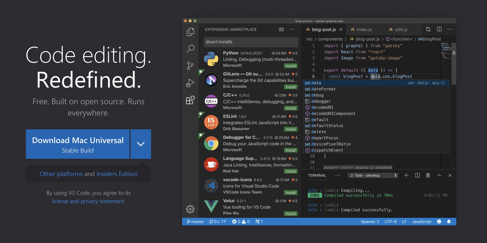
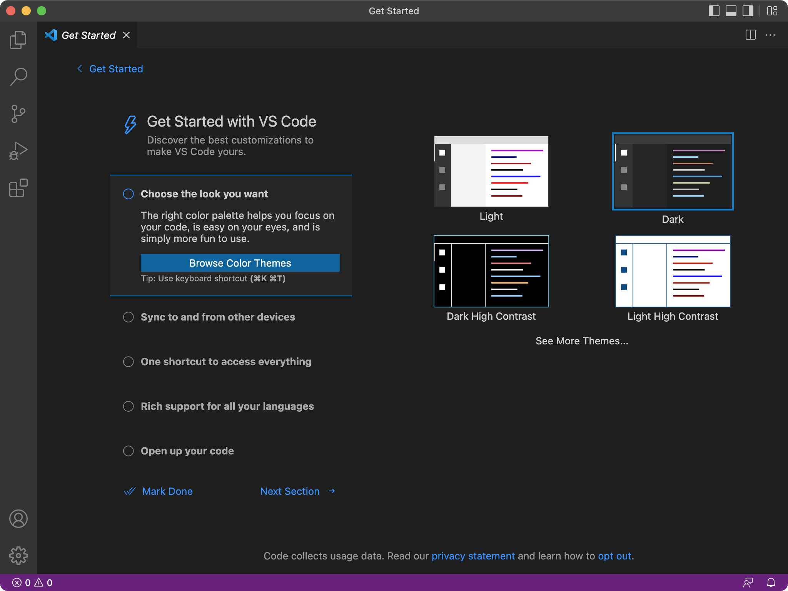
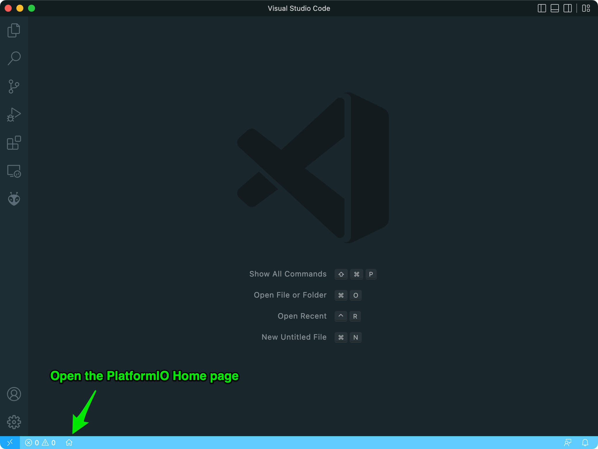

# {{ page.title }}

<span class="github"></span> [GitHub repository][lib]{: target="_blank" }
{: .repo }

<div class="espboy tiny" style="float:right;margin-left:2em;"></div>

This library provides a driver for the [ESPboy][espboy] multi-gadget handheld created by [Roman Sokolov][roman]. It gives you easy control over all its peripherals (128x128 TFT screen, 8 push buttons, and *NeoPixel* RGB LED).

ESPboy library relies on the following dependencies:

- [Adafruit MCP23017 Arduino Library][mcp23017]
- [Adafruit MCP4725 Arduino Library][mcp4725]
- [LovyanGFX][lovyangfx]

I noticed that most of the developments around the ESPboy use the [TFT_eSPI][tftespi] library, but I prefer [LovyanGFX][lovyangfx], which has better optimizations and more easy configuration. Its author, [lovyan03][lovyan03], has kindly agreed to [add support for ESP8266 in LovyanGFX][lovyan8266] and, more specifically, for the ESPboy, to make our lives easier with his outstanding graphics display driver. You can thank him by starring :star: the [LovyanGFX][lovyangfx] library.

To help you get to grips with this ESPboy library and make it easier for you to develop your projects on ESPboy, we will go through the different steps to help you get started.

Most of you are probably used to [Arduino IDE][arduino], but I also propose you to discover another development environment, easy to learn, and better designed for programming on microcontrollers: [PlatformIO IDE][platformio]. It's built on top of Microsoft's [Visual Studio Code][vscode], it's free and open source.

1. [Getting Started with PlatformIO IDE](#platformio-ide)
1. [Getting Started with Arduino IDE](#arduino-ide)


<a name="platformio-ide">

## Getting Started with PlatformIO IDE

Here is the process we will follow:

1. [Installing Visual Studio Code](#install-vscode)
1. [Adding plugins to Visual Studio Code](#add-plugins)
1. [Installing PlatformIO IDE](#platformio)
1. [Creating a new project for ESPboy](#platformio-project)
1. [Installing the ESPboy Library](#platformio-library)
1. [Compiling and uploading an example of the library](#platformio-example)


<a name="install-vscode">

### Installing Visual Studio Code

First of all, you need to install Visual Studio Code, which is an excellent editor for programming, and is recommended to use PlatformIO IDE. To do this, go to the download page:

[Download Visual Studio Code][vscode]{: .button target="_blank" }
{: .center }

You should land on this page:

{: .media .round-10 .shadow }

Download the version that corresponds to your OS (macOS, Linux or Windows), then launch the installation. Once the application is installed, simply open it:

{: .media .round-10 .shadow }

A customization tab is offered to you right away. You can come back to it later. For now, you can close it.


<a name="add-plugins">

### Adding plugins to Visual Studio Code

Visual Studio Code comes with a set of features that you can extend by adding plugins. There are all kinds of plugins, but let's take a look at two of them that will improve the visual appearance of the editor:

- [Material Icon Theme][material]{: target="_blank" }: lets you decorate the file explorer with beautiful icons.
- [Rainglow][rainglow]{: target="_blank" }: provides you with a collection of syntax and UI colored themes.

Let's see how with a short video:

<video controls muted preload="auto" class="media round-10 shadow">
    <source src="{{ 'assets/videos/vscode-plugins.mp4' | relative_url }}" type="video/mp4">
</video>


<a name="platformio">

### Installing PlatformIO IDE

The PlatformIO IDE is also a plugin that you can install to turn your new editor into a complete integrated development environment for microcontroller programming. Be patient, the installation may take a few minutes depending on your connection speed:

<video controls muted preload="auto" class="media round-10 shadow">
    <source src="{{ 'assets/videos/platformio-install.mp4' | relative_url }}" type="video/mp4">
</video>

To open the PlatformIO Home page, you will notice the  :house:  icon in the bottom bar of the editor window:

{: .media .round-10 .shadow }

Well, now that the development environment is installed, we can get down to business.  :wink:


<a name="platformio-project">

### Creating a new project for ESPboy

For the moment, PlatformIO does not yet include a development platform for a particular family of microcontrollers. When creating a new project, we have to specify the type of board we want to use. From there, PlatformIO will automatically download all the necessary tools for programming, compiling and uploading the code to the selected board.

The ESPboy embeds an ESP8266 on a <span class="emphasis">WeMos D1 mini</span> board.  
So let's see how to create a new project by setting the right board:

<video controls muted preload="auto" class="media round-10 shadow">
    <source src="{{ 'assets/videos/platformio-project.mp4' | relative_url }}" type="video/mp4">
</video>

You can see that after creating the project, a new [Espressif 8266][esp8266]{: target="_blank" } development platform has appeared in the <span class="emphasis">Platforms</span> section of PlatformIO. Installing the tools for a new platform may take a few minutes the first time, but it won't be necessary for a future project based on the same microcontroller family.

At the end of the creation process, the editor displays the contents of a file named `platformio.ini`. Every PlatformIO project has a `platformio.ini` configuration file in the root directory of the project. It is precisely in this file that we will define a set of properties specific to the project.

Each project may have multiple configuration environments defining the available project tasks for building, programming, debugging, unit testing, device monitoring, library dependencies, etc. The configuration environments are declared using `[env]` sections in `platformio.ini`.

A section with an `env:` prefix defines a working environment. Multiple `[env:name]` environments with different `name` are allowed. Every project must define at least one working environment. By default, the predefined working environment has the name of the board selected during the project setup. But we can name it whatever we want. We'll see about that later.

You will notice that we also find the specifications of:

- the platform: Espressif 8266
- the board: D1 mini
- and the Arduino C++ framework

...that we had defined when we created the project:

```ini
[env:d1_mini]
platform  = espressif8266
board     = d1_mini
framework = arduino
```

To this we have added the following properties to specify the operating frequency of the microcontroller, as well as the communication speed of the serial monitor and the upload speed used to flash the program:

```ini
[env:d1_mini]
platform          = espressif8266
board             = d1_mini
framework         = arduino
board_build.f_cpu = 80000000L ; or 160000000L if performance is needed
monitor_speed     = 115200
upload_speed      = 1500000
```

Now we just need to add a dependency to the ESPboy library to start coding.


<a name="platformio-library">

### Installing the ESPboy Library

The ESPboy library is now part of the official PlatformIO registry.  
Let's see how to install it easily in our project with PlatformIO's library explorer:

<video controls muted preload="auto" class="media round-10 shadow">
    <source src="{{ 'assets/videos/platformio-library.mp4' | relative_url }}" type="video/mp4">
</video>

Here we have renamed our working environment by replacing `d1_mini` with `espboy`, but you can choose any name you like. Then, to indicate that our project relies on the ESPboy library, we must add this dependency:

```ini
lib_deps = m1cr0lab/ESPboy @ ^1.2.1
```

:warning:  Be sure to enter the latest version.

Simply saving the `platformio.ini` file then triggers the <span class="emphasis">automatic download</span> of the ESPboy library from its GitHub repository, <span class="emphasis">along with all its own dependencies!</span> Isn't that magic? I told you PlatformIO would make things easier.  :wink:

You can see that all the libraries on which our project is relying on now appear in the file explorer, under the `.pio/libdeps/espboy` folder. These are all the dependencies of the ESPboy library that have been downloaded automatically by PlatformIO:

```
.pio/libdeps/espboy
├── Adafruit BusIO
├── Adafruit MCP23017 Arduino Library
├── Adafruit MCP4725
├── ESPboy
└── LovyanGFX
```

:clock230:  The download of all the dependencies may take some time depending on your connection speed.

From this point on, we can finally start coding using the definitions in the ESPboy library. The source file that is the entry point for your program is named `main.cpp` by default and is located in the `src` folder.

The bare minimum to start coding with the ESPboy library is the following code:

```cpp
#include <ESPboy.h>

void setup() {

    espboy.begin();

}

void loop() {

    espboy.update();

}
```

The `espboy` object is predefined by the library and corresponds to the programming interface to interact with the ESPboy driver. Beyond this simplistic source code that doesn't do anything very exciting, let's pick a more interesting one among the [examples][examples]{: target="_blank"} provided with the library.


<a name="platformio-example">

### Compiling and uploading an example of the library

The `examples` folder contains some source code that will help you get to grips with the ESPboy library by covering its main features:

```
examples
├── 1-bootstrap
├── 2-splash-screen
├── 3-buttons
├── 4-neopixel
├── 5-game-of-life
├── 6-fireworks
├── 7-snake
├── 8-spaceship
└── 9-2048
```

You can test them simply by copying their contents into the `main.cpp` file of your project:

<video controls muted preload="auto" class="media round-10 shadow">
    <source src="{{ 'assets/videos/platformio-example.mp4' | relative_url }}" type="video/mp4">
</video>

Here we have taken the <span class="emphasis">fireworks</span> example, but you can apply the same procedure for any of them.

```
examples
└── 6-fireworks
    └── 6-fireworks.ino
```

You can see that the example source codes have the `.ino` extension.  
It's just to comply with the Arduino IDE.

After copying the source code into the `main.cpp` file of our project, we can build and upload the program to the ESPboy to enjoy the result:

<div style="display:grid;grid-template-columns:auto 136px;gap:2em;align-items:center;">
    
    <div class="espboy tiny" style="margin:2em auto;">
        
    </div>
</div>

:warning:  Don’t forget to connect your ESPboy to your PC with a USB cable and turn it on before uploading.


<a name="arduino-ide">

## Getting Started with Arduino IDE

Here is the process we will follow:

1. [Installing the ESPboy Library with the right ESP8266 board](#arduino-library)
1. [Compiling and uploading an example of the library](#arduino-example)


<a name="arduino-library">

### Installing the ESPboy Library with the right ESP8266 board

The first thing to do is to install the appropriate development environment to program the ESP8266 of the <span class="emphasis">Wemos D1 mini</span> board that drives the ESPboy.

To do this, you need to open the Arduino IDE <span class="emphasis">Preferences</span> panel and fill in the <span class="emphasis">Additional Boards Manager URLs</span> field with the following value:

```
https://arduino.esp8266.com/stable/package_esp8266com_index.json
```

We'll then be able to download the necessary toolchain and all the ESP8266 boards available for the Arduino IDE. Once downloaded, we are ready to select the <span class="emphasis">LOLIN(WEMOS) D1 R2 & mini</span> board to program the ESPboy. To be able to upload our programs to the ESPboy, we also need to indicate the serial port to which the console is connected.

To finish the configuration of the development environment, we have to download and install the ESPboy library using the library manager of the Arduino IDE, which will also suggest downloading and installing all the library dependencies.

Here is how to proceed to perform all these essential steps:

<video controls muted preload="auto" class="media round-10 shadow">
    <source src="{{ 'assets/videos/arduino-library.mp4' | relative_url }}" type="video/mp4">
</video>

From this point on, we can finally start coding using the definitions in the ESPboy library. The bare minimum to start coding with the ESPboy library is the following sketch:

```cpp
#include <ESPboy.h>

void setup() {

    espboy.begin();

}

void loop() {

    espboy.update();

}
```

The `espboy` object is predefined by the library and corresponds to the programming interface to interact with the ESPboy driver. Beyond this simplistic sketch that doesn't do anything very exciting, let's pick a more interesting one among the [examples][examples]{: target="_blank"} provided with the library.


<a name="arduino-example">

### Compiling and uploading an example of the library

The `examples` folder contains some sketches that will help you get to grips with the ESPboy library by covering its main features:

```
examples
├── 1-bootstrap
├── 2-splash-screen
├── 3-buttons
├── 4-neopixel
├── 5-game-of-life
├── 6-fireworks
├── 7-snake
├── 8-spaceship
└── 9-2048
```

Let's take the <span class="emphasis">fireworks</span> sketch, for example:

<video controls muted preload="auto" class="media round-10 shadow">
    <source src="{{ 'assets/videos/arduino-example.mp4' | relative_url }}" type="video/mp4">
</video>

Once compiled and uploaded to the ESPboy, the program starts, and you can finally enjoy the result:

<div class="espboy tiny" style="margin:2em auto;">
    
</div>


[lib]:        https://github.com/m1cr0lab-espboy/ESPboy
[espboy]:     https://www.espboy.com/
[roman]:      https://github.com/ESPboy-edu
[mcp23017]:   https://github.com/adafruit/Adafruit-MCP23017-Arduino-Library
[mcp4725]:    https://github.com/adafruit/Adafruit_MCP4725
[lovyangfx]:  https://github.com/lovyan03/LovyanGFX
[lovyan8266]: https://github.com/lovyan03/LovyanGFX/issues/130
[lovyan03]:   https://github.com/lovyan03
[tftespi]:    https://github.com/Bodmer/TFT_eSPI
[arduino]:    https://www.arduino.cc/en/software
[platformio]: https://platformio.org/platformio-ide
[vscode]:     https://code.visualstudio.com/
[material]:   https://github.com/PKief/vscode-material-icon-theme
[rainglow]:   https://github.com/rainglow/vscode
[esp8266]:    https://github.com/platformio/platform-espressif8266
[examples]:   https://github.com/m1cr0lab-espboy/ESPboy/tree/main/examples