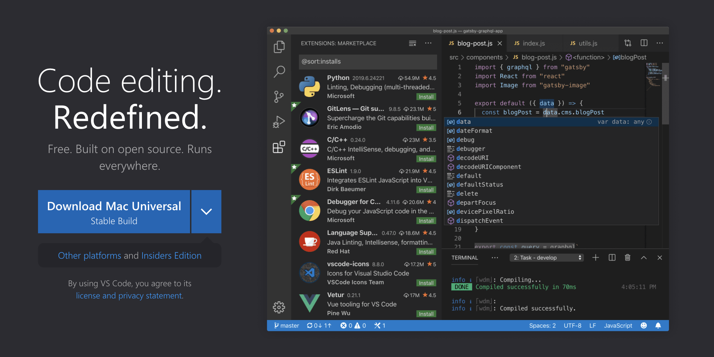
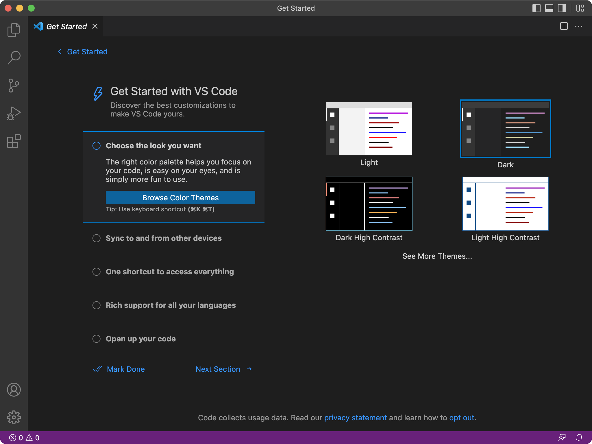
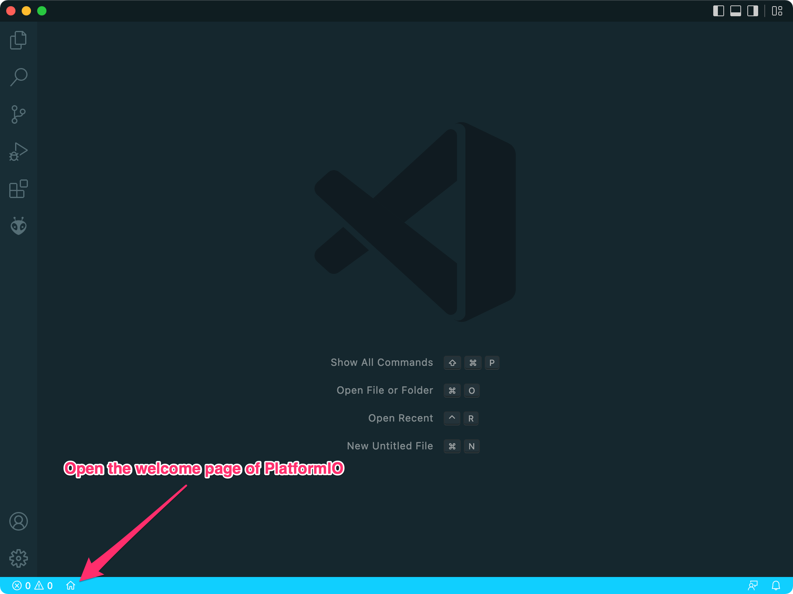
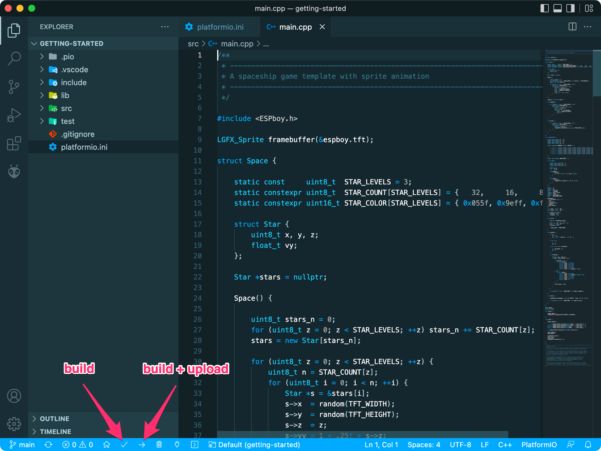

# {{ page.title }}

<div class="espboy small" style="float:right;margin-left:2em;"></div>

This library provides a driver for the [ESPboy][espboy] handheld designed by Roman Sokolov.

It relies on the following dependencies:

- [Adafruit MCP23017 Arduino Library][mcp23017]
- [Adafruit MCP4725 Arduino Library][mcp4725]
- [LovyanGFX][lovyangfx]

I noticed that most of the developments around the ESPboy have embraced Bodmer's [TFT_eSPI][tftespi] library, but I prefer the [LovyanGFX][lovyangfx] library which has better optimizations. Its author, lovyan03, has kindly agreed to [add support for ESP8266][lovyan8266] to make our life with ESPboy easier. You can thank him by starring :star: his library.

GitHub repository: [ESPboy Library][lib]{: target="_blank" }


## Getting Started

To help you get to grips with this ESPboy library and make it easier for you to develop your projects on ESPboy, we will go through the different steps to help you get started.

Most of you are probably used to [Arduino IDE][arduino], but I propose here to discover another environment, easy to learn, and better designed for programming on microcontrollers: [PlatformIO IDE][platformio]. It's built on top of Microsoft's [Visual Studio Code][vscode], it's free and open source.

So here is the process we will follow:

1. [Installing Visual Studio Code](#install-vscode)
1. [Adding plugins to Visual Studio Code](#add-plugins)
1. [Installing PlatformIO IDE](#platformio)
1. [Creating a new project for ESPboy](#new-project)
1. [Embedding the ESPboy library](#library)
1. [Testing an example of the library](#example)
1. [Compiling and uploading code to the ESPboy](#building)


<a name="install-vscode">

### Installing Visual Studio Code

First of all, you need to install Visual Studio Code, which is an excellent editor for programming, and is recommended to use PlatformIO IDE. To do this, go to the download page:

[Download Visual Studio Code][vscode]{: .button target="_blank" }
{: .center }

You should land on this page:

{: .media .round-10 .shadow }

Download the version that corresponds to your OS (macOS, Linux or Windows), then launch the installation. Once the application is installed, simply open it:

{: .media .round-10 .shadow }

A customization tab is offered to you right away. You can come back to it later. For now, you can close it.


<a name="add-plugins">

### Adding plugins to Visual Studio Code

Visual Studio Code comes with a set of features that you can extend by adding plugins. There are all kinds of plugins, but let's take a look at two of them that will improve the visual appearance of the editor:

- [Material Icon Theme][material]{: target="_blank" }: lets you decorate the file explorer with beautiful icons.
- [Rainglow][rainglow]{: target="_blank" }: provides you with a collection of syntax and UI colored themes.

Let's see how with a short video:

<video controls muted preload="auto" class="media round-10 shadow">
    <source src="{{ 'assets/videos/vscode-plugins.mp4' | relative_url }}" type="video/mp4">
</video>


<a name="platformio">

### Installing PlatformIO IDE

The PlatformIO IDE is also a plugin that you can install to turn your new editor into a complete integrated development environment for microcontroller programming. Be patient, the installation may take a few minutes depending on your connection speed:

<video controls muted preload="auto" class="media round-10 shadow">
    <source src="{{ 'assets/videos/platformio-install.mp4' | relative_url }}" type="video/mp4">
</video>

To open the PlatformIO welcome page, you will notice the :house: icon in the bottom bar of the editor window:

{: .media .round-10 .shadow }

Well, now that the development environment is installed, we can get down to business.  :wink:


<a name="new-project">

### Creating a new project for ESPboy

For the moment, PlatformIO does not yet include a development platform for a particular family of microcontrollers. When creating a new project, we have to specify the type of board we want to use. From there, PlatformIO will automatically download all the necessary tools for programming, compiling and uploading the code to the selected board.

The ESPboy embeds an ESP8266 on a <span class="emphasis">WeMos D1 mini</span> board.  
So let's see how to create a new project by setting the right board:

<video controls muted preload="auto" class="media round-10 shadow">
    <source src="{{ 'assets/videos/espboy-project.mp4' | relative_url }}" type="video/mp4">
</video>

You can see that after creating the project, a new [Espressif 8266][esp8266]{: target="_blank" } development platform has appeared in the <span class="emphasis">Platforms</span> section of PlatformIO. Installing the tools for a new platform may take a few minutes the first time, but it won't be necessary for a future project based on the same microcontroller family.

At the end of the creation process, the editor displays the contents of a file named `platformio.ini`. Every PlatformIO project has a `platformio.ini` configuration file in the root directory of the project. It is precisely in this file that we will define a set of properties specific to the project.

Each project may have multiple configuration environments defining the available project tasks for building, programming, debugging, unit testing, device monitoring, library dependencies, etc. The configuration environments are declared using `[env]` sections in `platformio.ini`.

A section with an `env:` prefix defines a working environment. Multiple `[env:name]` environments with different `name` are allowed. Every project must define at least one working environment. By default, the predefined working environment has the name of the board selected during the project setup. But we can name it whatever we want. We'll see about that later.

You will notice that we also find the specifications of:

- the platform: Espressif 8266
- the board: D1 mini
- and the Arduino C++ framework

...that we had defined when we created the project:

```ini
[env:d1_mini]
platform  = espressif8266
board     = d1_mini
framework = arduino
```

To this we have added the following properties to specify the operating frequency of the microcontroller, as well as the communication speed of the serial monitor and the upload speed used to flash the program:

```ini
[env:d1_mini]
platform          = espressif8266
board             = d1_mini
framework         = arduino
board_build.f_cpu = 80000000L
monitor_speed     = 115200
upload_speed      = 1500000
```

Now we just need to add a dependency to the ESPboy library to start coding.


<a name="library">

### Embedding the ESPboy library

<video controls muted preload="auto" class="media round-10 shadow">
    <source src="{{ 'assets/videos/espboy-library.mp4' | relative_url }}" type="video/mp4">
</video>

First of all, we rename the working environment by replacing `d1_mini` with `espboy`. Then we add a dependency to the ESPboy library:

```ini
lib_deps = https://github.com/m1cr0lab-espboy/ESPboy
```

Simply saving the `platformio.ini` file then triggers the <span class="emphasis">automatic download</span> of the ESPboy library from its GitHub repository, <span class="emphasis">along with all its own dependencies!</span> Isn't that magic? I told you PlatformIO would make things easier.  :wink:

You can see that the libraries needed for the project appear progressively in the file explorer, under the `.pio/libdeps/espboy` folder:

```
.pio/libdeps/espboy
├── Adafruit BusIO
├── Adafruit MCP23017 Arduino Library
├── Adafruit MCP4725
├── ESPboy
└── LovyanGFX
```

You can also notice that as long as the download of the dependencies is not finished, a file named `espboy.lock` is present in the receiving folder. The download of all the dependencies may take some time depending on your connection speed, especially for the LovyanGFX library. But once the download is finished, the `espboy.lock` file disappears.

From this point on, we can finally start coding using the definitions in the ESPboy library. The source file that is the entry point for your program is named `main.cpp` by default and is located in the `src` folder.

The bare minimum to start coding with the ESPboy library is the following code:

```cpp
#include <ESPboy.h>

void setup() {
    espboy.begin();
}

void loop() {
    espboy.update();
}
```

The `espboy` object is predefined by the library and corresponds to the programming interface to interact with the ESPboy driver. Beyond this simplistic source code that doesn't do anything very exciting, let's pick a more interesting one among the [examples][examples]{: target="_blank"} provided with the library.


<a name="example">

### Testing an example of the library

The `examples` folder contains some source code that will help you get to grips with the ESPboy library by covering its main features:

```
examples
├── 1-bootstrap.cpp
├── 2-start-logo.cpp
├── 3-buttons.cpp
├── 4-neopixel.cpp
├── 5-game-of-life.cpp
├── 6-snake.cpp
└── 7-spaceship.cpp
```

You can test them easily by copying their contents into the `main.cpp` file of your project:

<video controls muted preload="auto" class="media round-10 shadow">
    <source src="{{ 'assets/videos/espboy-example.mp4' | relative_url }}" type="video/mp4">
</video>


<a name="building">

### Compiling and uploading code to the ESPboy

To compile your project and upload the program to your ESPboy, use the buttons shown below:

{: .media .round-10 .shadow }

Don't forget to connect your ESPboy to your PC with a USB cable and turn it on before uploading.

<div class="espboy" style="margin:2em auto;">
    
</div>


[lib]:        https://github.com/m1cr0lab-espboy/ESPboy
[espboy]:     https://www.espboy.com/
[arduino]:    https://www.arduino.cc/en/software
[platformio]: https://platformio.org/platformio-ide
[vscode]:     https://code.visualstudio.com/
[mcp23017]:   https://github.com/adafruit/Adafruit-MCP23-Arduino-Library
[mcp4725]:    https://github.com/adafruit/Adafruit_MCP4725
[lovyangfx]:  https://github.com/lovyan03/LovyanGFX
[tftespi]:    https://github.com/Bodmer/TFT_eSPI
[lovyan8266]: https://github.com/lovyan03/LovyanGFX/issues/130
[material]:   https://github.com/PKief/vscode-material-icon-theme
[rainglow]:   https://github.com/rainglow/vscode
[esp8266]:    https://github.com/platformio/platform-espressif8266
[examples]:   https://github.com/m1cr0lab-espboy/ESPboy/tree/main/examples